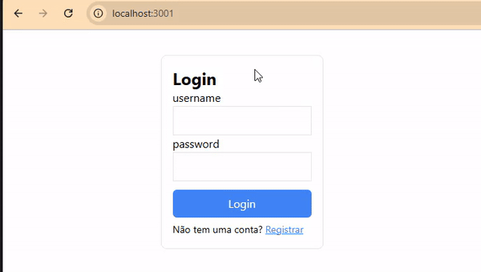

## Express/Next.JS JWT Token Authentication

Este projeto demonstra uma integração completa entre um backend em **Express** e um frontend em **Next.js** para autenticação JWT (JSON Web Token). Ele inclui funcionalidades essenciais, como **registro**, **login**, **rotas protegidas**, **renovação automática de tokens** e usa **server actions** para garantir a segurança.

Ideal como um **boilerplate** para novos projetos que exigem autenticação segura e integração frontend/backend.

---

## 🚀 Funcionalidades

- 🔐 **Autenticação JWT**:

  - Registro de novos usuários.
  - Login com validação de credenciais.
  - Geração de tokens de acesso e renovação de tokens.

- 🔒 **Rotas Protegidas**:

  - Verificação automática de tokens antes de acessar páginas ou endpoints.
  - Redirecionamento em caso de sessão expirada.

- ♻️ **Renovação Automática de Token**:
  - Tokens podem ser renovados automaticamente antes de fazer uma requisição, mantendo a sessão do usuário ativa sem interrupções.

---

